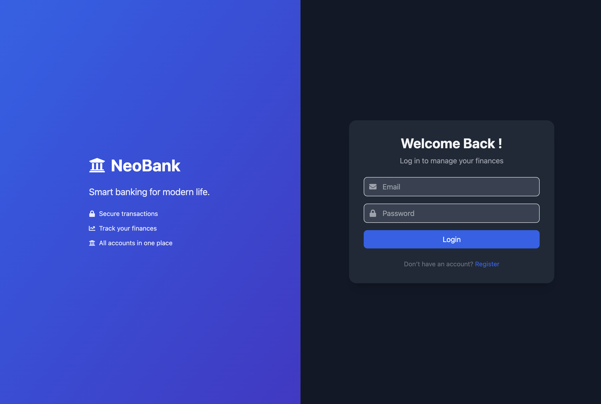
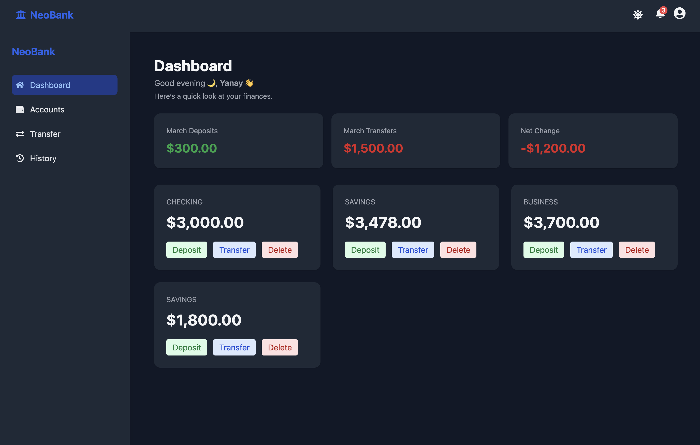
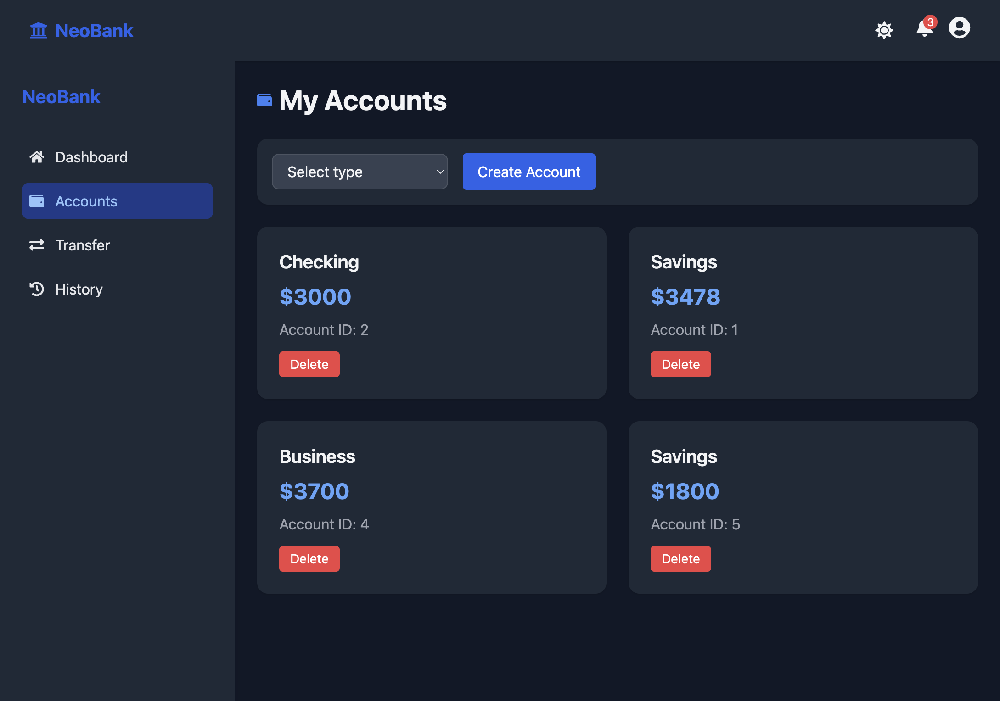
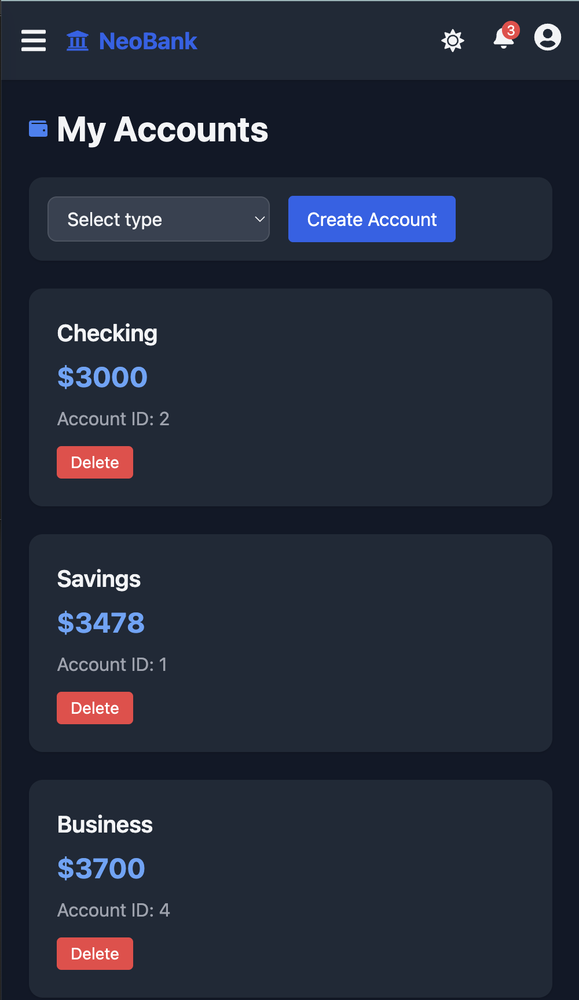

# 🏦 NeoBank — Full Stack Banking App

Modern fintech landing app that allows users to manage accounts, perform transfers, track transactions, and monitor their finances in real time.

## 🚀 Live Demo
https://neobankinc.netlify.app/

## 🧠 Description
A responsive and visually polished fintech UI designed to simulate a modern digital banking experience.

Focuses on clean design, layout structure, and user experience.

---

## ✨ Features

- 🔐 JWT Authentication (Login / Register)
- 🌙 Dark / Light Mode
- 💳 Multiple Bank Accounts
- 💰 Deposits & Transfers
- 📊 Monthly Financial Summary
- 📄 Transaction History
- 📱 Responsive Design (Mobile & Desktop)
- 🔔 Notifications & Profile Menu
- 🧭 Protected Routes

---

## 🖥️ Tech Stack

### Frontend
- React
- React Router
- Tailwind CSS
- React Icons
- Axios

### Backend
- Node.js
- Express.js
- PostgreSQL / MySQL (or your DB)
- JWT Authentication
- REST API

---

## 📸 Screenshots

> (Add later — see instructions below)

### Login

### Dashboard

### Accounts

### Mobile

---

## 🚀 Getting Started

### 1️⃣ Clone the repository

bash
git clone https://github.com/your-username/neobank.git
cd neobank

---

### 2️⃣ Clone the repository

cd server
npm install

---

Create .env file:
PORT=5000
DB_HOST=localhost
DB_USER=your_user
DB_PASSWORD=your_password
DB_NAME=neobank
JWT_SECRET=your_secret

Run server:
npm start

### 3️⃣ Clone the repository

cd client
npm install
npm run dev

App runs at:
http://localhost:5173

 📂 API Endpoints (Sample)

| Method | Endpoint               | Description  |
| ------ | ---------------------- | ------------ |
| POST   | /auth/login            | Login        |
| POST   | /auth/register         | Register     |
| GET    | /accounts              | Get accounts |
| POST   | /accounts/deposit      | Deposit      |
| POST   | /accounts/transfer     | Transfer     |
| GET    | /accounts/transactions | History      |

---

🧠 What I Learned

- Full-stack authentication
- Protected routing
- Responsive UI design
- State management
- Secure API communication
- Dark mode implementation
- Component architecture

---

🔮 Future Improvements

- Add dashboard page
- Simulated transactions
- Authentication UI
- Interactive components

👨‍💻 Author

Yanay Sánchez García

📜 License
This project is for educational and portfolio purposes.

